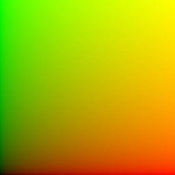
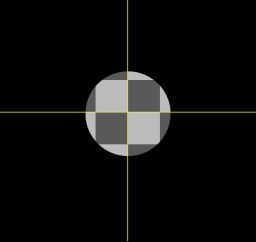
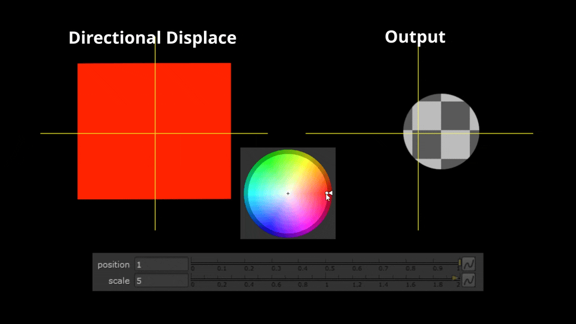

# Directional Displace Gizmo

Directional Displace is a Nuke gizmo that allows you to specify the displacement of pixels in an image using an HSV matte. It functions similarly to a normal map but in two dimensions.

## The Problem

ST maps are a common way to represent displacement in 2D images. They work by mapping the position of each pixel in a source image to a new position in an output image. For each pixel in the output image, the red and green channels in the ST map define the x and y coordinates of the corresponding pixel in the source image.

The following ST map would not make any changes to the input image. It gets redder from left to right as the X values of the pixels increase, and greener from bottom to top as the Y values increase.

In the next ST map, every pixel is `rgb(1, 0, 0)`, which means that every single pixel in the output image will be taken from the pixel at `(1, 0)` in the source image.

While ST maps are useful for representing displacements, they're not very human-readable. Directional displacement maps are meant to act as a more intuitive way to represent displacement in images for situations where you want to create a displacement map by hand.

## How Directional Displacement Maps Work

In a directional displacement map, the HSV (Hue/Saturation/Value) channels of an image are used to encode the angle, magnitude, and phase shift of a pixel displacement.

For the following examples, this is the source image. The yellow gridlines are meant to be a visual guide and will not be displaced with the rest of the source. 

The hue of the directional displacement map defines the angle of displacement as demonstrated below. Since hue is already represented as an angle in most color pickers, setting the direction of displacement usually means swiveling the color picker to point in the direction that you want your image to move.

The saturation of the directional displacement map defines the magnitude of displacement. The more saturated the color, the stronger the effect.

The value (darkness) of the directional displacement map defines the phase shift of the displacement, which changes the way it interacts with the `position` knob. By default, setting the `position` knob of the node to 0 will create no displacement and setting the knob to 1 will create maximum displacement. Changing the map's value allows you to change this behavior--for example, a map with value 0.5 will have maximum displacement at `position` 0 and no displacement at `position` 1.

Here's an example of the directional displacement gizmo in action in my short film [Whittled Down](https://whittleddownfilm.ollyglenn.com). The directional displacement map (top) was applied to the highlights and shadows on the 2D character in order to make the highlights and shadows flicker back and forth in the firelight. The effect is subtle, but it's easiest to see in the shadow on his belly and the highlight on his right arm.

https://github.com/ollyisonit/directional-displace-gizmo/assets/56850051/e5dd44a4-4b22-420a-9748-db58198074fa

# Controls
**Inputs**: 
- `src`: The image to be displaced
- `map`: The directional displacement map

**Knobs**
- `position`: The amount of displacement effect to apply. 0 corresponds to no displacement, 1 corresponds to maximum displacement
- `scale`: The intensity of the displacement effect.

# Installation
Download latest version [here](https://github.com/dninosores/directional-displace-gizmo/releases/latest).

Place `DirectionalDisplace.gizmo` in your `.nuke` folder to install. Access by pressing `X` to open the command editor and typing `DirectionalDisplace` to insert the node into your script. More info on accessing gizmos [here](https://learn.foundry.com/nuke/content/comp_environment/configuring_nuke/sourcing_gizmos.html).
